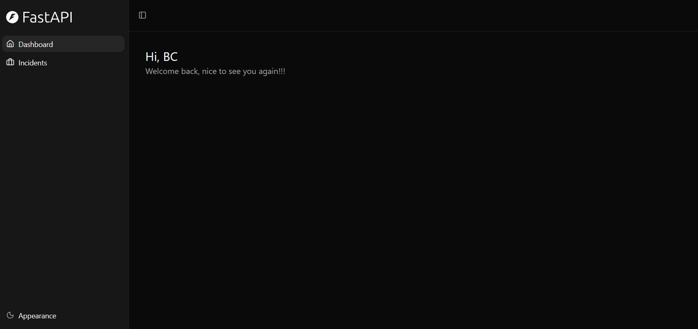
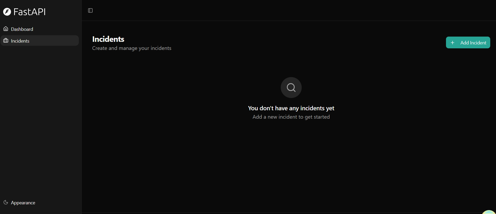
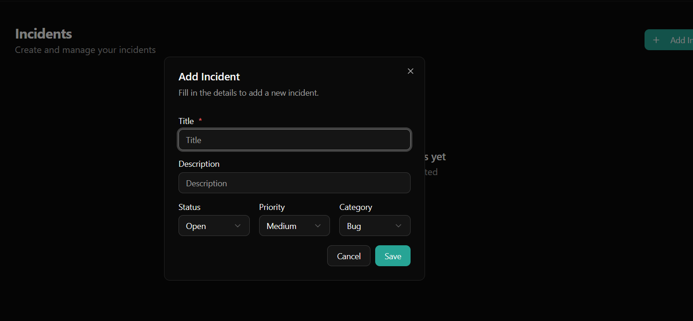
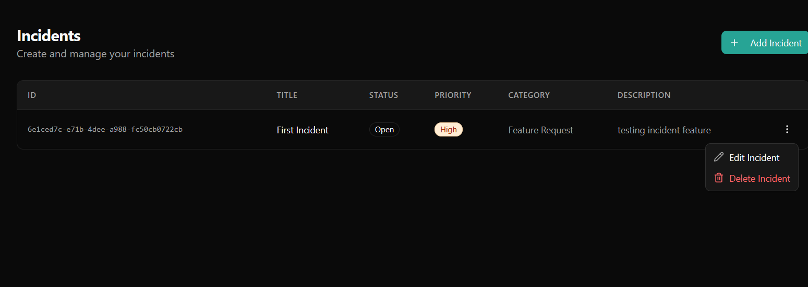

# Incident Tracker

A full-stack incident tracking application for managing and resolving incidents. Users can create incidents, assign them, track their status through a lifecycle (open, in progress, resolved), and collaborate via comments.

**This is a personal training project** built to learn full-stack development with Python (FastAPI) and React (TypeScript). It is not intended for production use.

## Technology Stack

- [FastAPI](https://fastapi.tiangolo.com) for the Python backend API
  - [SQLModel](https://sqlmodel.tiangolo.com) for database interactions (ORM)
  - [Pydantic](https://docs.pydantic.dev) for data validation and settings management
  - [PostgreSQL](https://www.postgresql.org) as the SQL database
- [React](https://react.dev) for the frontend
  - TypeScript, hooks, and [Vite](https://vitejs.dev)
  - [Tailwind CSS](https://tailwindcss.com) and [shadcn/ui](https://ui.shadcn.com) for UI components
  - Auto-generated API client from OpenAPI spec
- [Docker Compose](https://www.docker.com) for running the database
- JWT authentication with secure password hashing
- [Pytest](https://pytest.org) for backend tests

## Features

- **Incident management** — Create, update, and delete incidents with title, description, status, priority, and category
- **Incident lifecycle** — Track incidents through open, in progress, and resolved states with automatic resolved_at timestamps
- **Assignment** — Assign incidents to users
- **Comments** — Add and delete comments on incidents for collaboration
- **User management** — Admin panel for managing users with role-based access control
- **Authentication** — Login, signup, and password recovery via email

## Application





## Getting Started

### Prerequisites

- Python 3.12+
- Node.js 20+
- Docker (for PostgreSQL)
- [uv](https://docs.astral.sh/uv/) (Python package manager)

### Setup

1. Start the database:

```bash
docker compose up -d db
```

2. Run backend migrations and start the server:

```bash
cd backend
uv run alembic upgrade head
uv run fastapi dev app/main.py
```

3. Install frontend dependencies and start the dev server:

```bash
cd frontend
npm install
npm run dev
```

The frontend will be available at `http://localhost:5173` and the API at `http://localhost:8000`.

### Running Tests

```bash
cd backend
uv run pytest tests/ -v
```

## Project Structure

```
backend/
  app/
    api/routes/       -- API endpoints (incidents, comments, users, login)
    core/             -- Config, security, database setup
    models.py         -- Database models and schemas
    crud.py           -- Reusable CRUD operations
  tests/              -- Backend tests
  app/alembic/        -- Database migrations

frontend/
  src/
    routes/           -- Pages (file-based routing with TanStack Router)
    components/       -- React components (Incidents, Comments, Admin, UI)
    client/           -- Auto-generated API client
    hooks/            -- Custom React hooks (auth, toast, etc.)
```

## Based On

This project was bootstrapped from the [Full Stack FastAPI Template](https://github.com/fastapi/full-stack-fastapi-template) and customized for incident tracking.

## License
MIT
